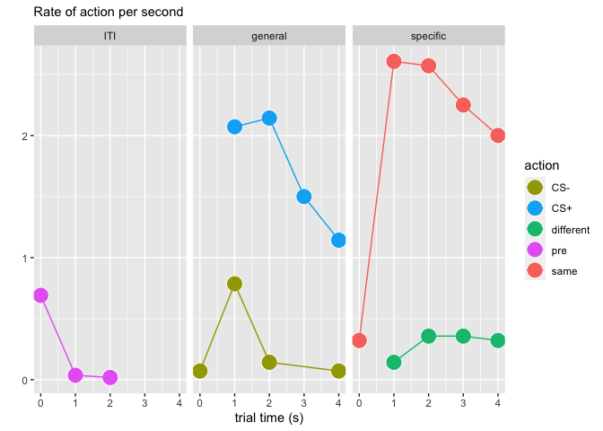

Proprocessing the transfer data
================

## GitHub Documents

This is an R Markdown format used for publishing markdown documents to
GitHub. It includes R code and code output (e.g., plots, tables, etc).

## Setup

We will use the tidyverse libraries to import the transfer data, wrangle
it, and plot it. The tidyverse is a set of libraries that includes
dplyr, ggplot2 and a few other libraries that are commonly used for data
science. If you haven’t installed the tidyverse, just type
`install.packages("tidyverse")` in your R command line.

We load the tidyverse libraries with a single library call:

``` r
library(tidyverse)
```

    ## ── Attaching packages ─────────────────────────────────────── tidyverse 1.3.0 ──

    ## ✓ ggplot2 3.3.3     ✓ purrr   0.3.4
    ## ✓ tibble  3.1.2     ✓ dplyr   1.0.4
    ## ✓ tidyr   1.1.2     ✓ stringr 1.4.0
    ## ✓ readr   1.4.0     ✓ forcats 0.5.1

    ## ── Conflicts ────────────────────────────────────────── tidyverse_conflicts() ──
    ## x dplyr::filter() masks stats::filter()
    ## x dplyr::lag()    masks stats::lag()

<br>

The tidyverse loads with a few messages and warnings. We can ignore
those for the moment.

<br>

## Importing the data

For now we will import a single log file from a participant and examine
it (e.g., “6062\_transfer\_2019\_Feb\_19\_1106.log”). Later we will
create a function to generate everything we need from each log file, but
we can’t do that yet as we don’t know how the data is going to behave.
`read_tsv()` imports tab delimited text files. We just give it the path
to the file and filename (you can always check which directory R is
working in using `getwd()`).

``` r
raw_data <- read_tsv(
  "data/demo_transfer_2021_Jun_29_2128.log", # the log filename from the first participant
  col_names = c("seconds", "type", "message"), # the names we want read_tsv() to give our columns 
  skip = 10 # we will skip the first three lines which contain some error messages we don't want
  ) %>%
  filter(type == "DATA") %>%
  select(seconds, message) # just take the two columns we want
```

    ## 
    ## ── Column specification ────────────────────────────────────────────────────────
    ## cols(
    ##   seconds = col_double(),
    ##   type = col_character(),
    ##   message = col_character()
    ## )

<br>

The import tells us how each column was “parsed”. We imported three
columns, named “seconds”, “type” and “message”. “seconds” is a column of
numbers (doubles), “type” and “message” are columns of characters. We
saved the data in a dataframe called **raw\_data**.

We can peek at the **raw\_data** using `head()`, which shows us the
first six rows of the dataframe:

``` r
head(raw_data)
```

    ## # A tibble: 6 x 2
    ##   seconds message             
    ##     <dbl> <chr>               
    ## 1    14.6 version A           
    ## 2    17.2 start_images/fix.png
    ## 3    17.2 Keypress: space     
    ## 4    23.3 end_images/fix.png  
    ## 5    23.3 start_images/red.png
    ## 6    24.3 Keypress: t

<br>

The raw data is a list of events (messages) and the time the event
occurred (message was sent).

## Preprocessing

There is a little bit of preprocessing we need to do (aka *data
wrangling*, *munging*, etc) on this raw data. For instance, we want to
adjust all the seconds so the zero time point is when the trigger
occurred. To do that we need to find the time the fixation cross
disappeared.

``` r
start_time <- raw_data %>%
  filter(message == "end_images/fix.png") %>%
  slice_max(seconds) %>% # select the latest trigger time (in case there are more than one)
  pull(seconds) 
```

The start time was 23.2643 seconds. We will subtract this value from all
the recorded times so all the events are relative to the trigger (i.e.,
TRIGGERED = 0). Then we will select those events which occurred after
the trigger.

``` r
data_corrected <- raw_data %>%
  mutate(seconds = seconds - start_time) %>%
  filter(seconds > 0)

head(data_corrected)
```

    ## # A tibble: 6 x 2
    ##   seconds message             
    ##     <dbl> <chr>               
    ## 1  0.0498 start_images/red.png
    ## 2  1.05   Keypress: t         
    ## 3  1.35   Keypress: t         
    ## 4  1.63   Keypress: t         
    ## 5  1.92   Keypress: t         
    ## 6  2.12   Keypress: t

<br>

Now we need the time of each CS trial.

``` r
CS_times <- data_corrected %>%
  filter(str_detect(message, ".png")) %>% 
  mutate(                                 
    trial_onset = if_else(str_detect(message, "start_"), "Start", "End"),
    CS = str_remove_all(message, 
                        paste(c("start_images/", "end_images/", ".png"), 
                              collapse = "|"))) %>% 
  group_by(CS, trial_onset) %>% 
  mutate(trial_n = row_number()) %>% 
  ungroup() %>%
  unite(trial, CS, trial_n) %>%
  select(-message) %>%
  pivot_wider(names_from = "trial_onset", values_from = "seconds")
    
head(CS_times)
```

    ## # A tibble: 6 x 3
    ##   trial     Start   End
    ##   <chr>     <dbl> <dbl>
    ## 1 red_1    0.0498  5.05
    ## 2 vend_1   5.10   14.1 
    ## 3 blue_1  14.1    19.1 
    ## 4 vend_2  19.2    28.2 
    ## 5 green_1 28.2    33.2 
    ## 6 vend_3  33.3    42.3

<br>

Hopefully that looks sensible. With the CS times in a nice table, we can
now associate each button press with a CS or the ITI.

``` r
which_CS <- function(x) {
  ans = CS_times$trial[which(x < CS_times$End & x > CS_times$Start)]
  if (length(ans) < 1) {
    ans = NA_character_}
  return(ans)
}

button_press_times <- data_corrected %>%
  filter(str_detect(message, "Keypress")) %>%
  rename(deciseconds = seconds, keypress = message) %>%
  mutate(keypress = str_remove(keypress, "Keypress: ")) %>%
  filter(keypress %in% c("t", "v")) %>%
  rowwise() %>%
  mutate(
    trial = which_CS(deciseconds),
  ) %>%
  ungroup() %>% 
  left_join(select(CS_times, trial, Start)) %>%
  mutate(trial_seconds = deciseconds - Start)
```

    ## Joining, by = "trial"

``` r
head(button_press_times)
```

    ## # A tibble: 6 x 5
    ##   deciseconds keypress trial  Start trial_seconds
    ##         <dbl> <chr>    <chr>  <dbl>         <dbl>
    ## 1        1.05 t        red_1 0.0498          1.00
    ## 2        1.35 t        red_1 0.0498          1.31
    ## 3        1.63 t        red_1 0.0498          1.58
    ## 4        1.92 t        red_1 0.0498          1.87
    ## 5        2.12 t        red_1 0.0498          2.07
    ## 6        2.38 t        red_1 0.0498          2.33

<br>

We now need to determine the experimental condition of each trial and
assign them to each action.

``` r
# Relabel actions and CS by condition (e.g,. same, different, CSplus)
  # Version Action      Red   Green Blue  Yellow
  # A       keypress:a  Same  Diff  CS+   CS-
  # A       keypress:b  Diff  Same  CS+   CS-
  # B       keypress:a  Same  CS+   Diff  CS-
  # B       keypress:b  Diff  CS+   Same  CS-
  # C       keypress:a  CS+   Diff  Same  CS-
  # C       keypress:b  CS+   Same  Diff  CS-

counterbalance_version <- filter(raw_data, str_detect(message, "version")) %>%
  mutate(message = str_remove(message, "version ")) %>%
  pull(message)

action_times <- button_press_times %>%
  mutate(ver = counterbalance_version) %>%
  separate(trial, into = c("CS_col", "trial_n")) %>%
  mutate(
      CS_condition = case_when(
        ver == "A" & CS_col %in% c("red", "green")    ~ "specific",
        ver == "A" & CS_col %in% c("blue")            ~ "general",
        ver == "B" & CS_col %in% c("red", "blue")     ~ "specific",
        ver == "B" & CS_col %in% c("green")           ~ "general",
        ver == "C" & CS_col %in% c("blue", "green")   ~ "specific",
        ver == "C" & CS_col %in% c("red")             ~ "general",
        CS_col == "yellow"                            ~ "general-",
        CS_col == "vend"                              ~ "ITI",
        TRUE ~ NA_character_
      ),
      action = case_when(
        !is.na(keypress) & CS_condition == "ITI"            ~ "pre",
        !is.na(keypress) & CS_condition == "general-"       ~ "CS-",
        ver == "A"   & CS_col == "blue"  & !is.na(keypress) ~ "CS+",
        ver == "A"   & CS_col == "red"   & keypress == "t"  ~ "same",
        ver == "A"   & CS_col == "red"   & keypress == "v"  ~ "different",
        ver == "A"   & CS_col == "green" & keypress == "t"  ~ "different",
        ver == "A"   & CS_col == "green" & keypress == "v"  ~ "same",
        ver == "B"   & CS_col == "green" & !is.na(keypress) ~ "CS+",
        ver == "B"   & CS_col == "red"   & keypress == "t"  ~ "same",
        ver == "B"   & CS_col == "red"   & keypress == "v"  ~ "different",
        ver == "B"   & CS_col == "blue"  & keypress == "t"  ~ "different",
        ver == "B"   & CS_col == "blue"  & keypress == "v"  ~ "same",
        ver == "C"   & CS_col == "red"   & !is.na(keypress) ~ "CS+",
        ver == "C"   & CS_col == "blue"  & keypress == "t"  ~ "same",
        ver == "C"   & CS_col == "blue"  & keypress == "v"  ~ "different",
        ver == "C"   & CS_col == "green" & keypress == "t"  ~ "different",
        ver == "C"   & CS_col == "green" & keypress == "v"  ~ "same",
        TRUE ~ NA_character_
      )
    ) 
```

And then we count the number of actions in each condition per second.

``` r
action_counts <- select(action_times, 
                        deciseconds, CS_col, CS_condition, action, trial_seconds
                        ) %>%
  mutate(trial_seconds = floor(trial_seconds)) %>%
  count(CS_condition, CS_col, trial_seconds, action, name = "count") 

trial_counts <- CS_times %>%
  separate(trial, into = c("CS_col", "trial_n")) %>%
  mutate(duration = round(End - Start, 1)) %>%
  count(CS_col, duration, name = "N")

# Join action counts and trial counts and determine rate of action
action_rates <- left_join(action_counts, trial_counts) %>%
  group_by(CS_condition, action, trial_seconds) %>%
  summarise(
    action_rate = sum(count) / sum(N),
    .groups = "drop"
  )
```

    ## Joining, by = "CS_col"

## Plotting

We can now plot the data, for example:

``` r
action_rates %>%
  filter(!is.na(CS_condition)) %>%
  mutate(
    CS_condition = str_remove(CS_condition, "-"),
    CS_condition = fct_relevel(CS_condition, "ITI")
    ) %>% 
  ggplot(aes(x = trial_seconds, y = action_rate)) +
    geom_point(aes(fill = action), color = "white", shape = 21, size = 6) +
    geom_line(aes(group = action, color = action)) +
    scale_color_manual(values = c("#A3A500", "#00B0F6", "#00BF7D", "#E76BF3", "#F8766D")) +
    scale_fill_manual(values = c("#A3A500", "#00B0F6", "#00BF7D", "#E76BF3", "#F8766D")) +
    facet_wrap(~CS_condition) +
    labs(subtitle = "Rate of action per second", y = "", x = "trial time (s)") 
```

<!-- -->

<br>

The rate of actions/responses during the ITI period, general cue period
and specific cue periods is shown in each panel. The response rate
during the ITI period is low - the initial rate in the first few seconds
of the ITI period probably reflects residual pressing at the end of each
CS period. There is little indication the ITI supports any persistent
responding. As expected, the general excitatory cue (CS+) elicited
higher respone rates over the period than the control CS-. Finally, the
rate of specific actions is higher for the same outcome than the
different outcome during the cues for the instrumental outcomes.

<br>
