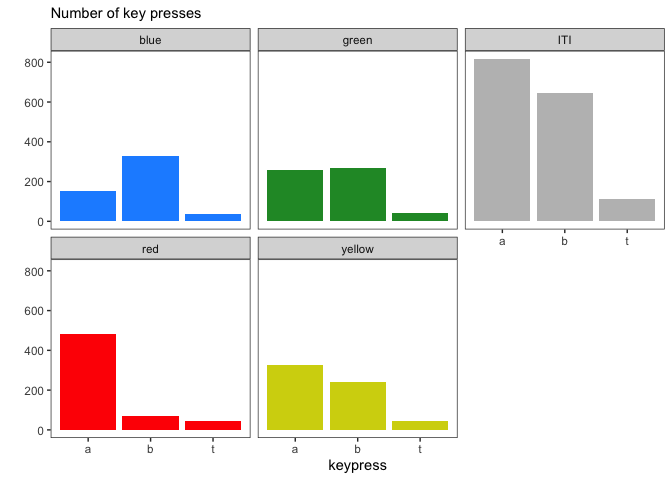

Proprocessing the transfer data
================

## GitHub Documents

This is an R Markdown format used for publishing markdown documents to
GitHub. It includes R code and code output (e.g., plots, tables, etc).

## Setup

We will use the tidyverse libraries to import the transfer data, wrangle
it, and plot it. The tidyverse is a set of libraries that includes
dplyr, ggplot2 and a few other libraries that are commonly used for data
science. If you haven’t installed the tidyverse, just type
`install.packages("tidyverse")` in your R command line.

We load the tidyverse libraries with a single library
    call:

``` r
library(tidyverse)
```

    ## ── Attaching packages ────────────────────────────────────────────────────────────────────────────────────────────── tidyverse 1.3.0 ──

    ## ✔ ggplot2 3.3.0     ✔ purrr   0.3.3
    ## ✔ tibble  2.1.3     ✔ dplyr   1.0.0
    ## ✔ tidyr   1.0.2     ✔ stringr 1.4.0
    ## ✔ readr   1.3.1     ✔ forcats 0.5.0

    ## ── Conflicts ───────────────────────────────────────────────────────────────────────────────────────────────── tidyverse_conflicts() ──
    ## ✖ dplyr::filter() masks stats::filter()
    ## ✖ dplyr::lag()    masks stats::lag()

<br>

The tidyverse loads with a few messages and warnings. We can ignore
those for the moment.

<br>

## Importing the data

For now we will import a single log file from a participant and examine
it (e.g., “6062\_transfer\_2019\_Feb\_19\_1106.log”). Later we will
create a function to generate everything we need from each log file, but
we can’t do that yet as we don’t know how the data is going to behave.
`read_tsv()` imports tab delimited text files. We just give it the path
to the file and filename (you can always check which directory R is
working in using `getwd()`).

``` r
raw_data <- read_tsv(
  "data/6062_transfer_2019_Feb_19_1106.log", # the log filename from the first participant
  col_names = c("seconds", "type", "message"), # the names we want read_tsv() to give our columns 
  skip = 3 # we will skip the first three lines which contain some error messages we don't want
  ) %>%
  select(seconds, message) # just take the two columsn we want
```

    ## Parsed with column specification:
    ## cols(
    ##   seconds = col_double(),
    ##   type = col_character(),
    ##   message = col_character()
    ## )

<br>

The import tells us how each column was “parsed”. We imported three
columns, named “seconds”, “type” and “message”. “seconds” is a column of
numbers (doubles), “type” and “message” are columns of characters. We
saved the data in a dataframe called **raw\_data**.

We can peek at the **raw\_data** using `head()`, which shows us the
first six rows of the dataframe:

``` r
head(raw_data)
```

    ## # A tibble: 6 x 2
    ##   seconds message                              
    ##     <dbl> <chr>                                
    ## 1    47.1 Keypress: a                          
    ## 2    50.6 Keypress: b                          
    ## 3    52.5 Keypress: a                          
    ## 4    71.3 Mouse: Left button down, pos=(50,234)
    ## 5    71.4 Mouse:  Left button up, pos=(50,234) 
    ## 6    80.0 Keypress: space

<br>

The raw data is a list of events (messages) and the time the event
occurred (message was sent).

## Preprocessing

There is a little bit of preprocessing we need to do (aka *data
wrangling*, *munging*, etc) on this raw data. For instance, we want to
adjust all the seconds so the zero time point is when the trigger
occurred. To do that we need to find the time the “TRIGGERED” message
was sent.

``` r
start_time <- raw_data %>%
  filter(message == "TRIGGERED") %>%
  slice_max(seconds) %>% # select the latest trigger time (in case there are more than one)
  pull(seconds) 
```

The start time was 96.4429 seconds. We will subtract this value from all
the recorded times so all the events are relative to the trigger (i.e.,
TRIGGERED = 0). Then we will select those events which occurred after
the trigger.

``` r
data_corrected <- raw_data %>%
  mutate(seconds = seconds - start_time) %>%
  filter(seconds >= 0)

head(data_corrected)
```

    ## # A tibble: 6 x 2
    ##   seconds message         
    ##     <dbl> <chr>           
    ## 1    0    TRIGGERED       
    ## 2    2.88 Keypress: a     
    ## 3    3.00 Keypress: lshift
    ## 4    3.00 Keypress: t     
    ## 5    6.00 Keypress: lshift
    ## 6    6.00 Keypress: t

<br>

Now we need the time of each CS trial.

``` r
CS_times <- data_corrected %>%
  filter(str_detect(message, ".png")) %>% # just take the rows with ".png" mentioned in the message
  mutate(                                 # create new columns based on the CS (indicated in message)
    trial = if_else(message == "vend.png", "End", "Start"),
    CS = str_remove(message, ".png"),
    CS = case_when(
      CS == "vend" ~ lag(CS),
      TRUE ~ CS),
    CS_trial = paste(trial, CS)
    ) %>%
  select(CS, seconds, trial) %>%
  pivot_wider(                            # Wrangle the columns into CS, Start, End
    names_from = "trial",
    values_from = "seconds",
    values_fn = list(seconds = list)
    ) %>% 
  unnest(cols = c(Start, End)) %>% 
  arrange(Start) 

head(CS_times)
```

    ## # A tibble: 6 x 3
    ##   CS     Start   End
    ##   <chr>  <dbl> <dbl>
    ## 1 red     10.1  18.1
    ## 2 blue    24.1  39.1
    ## 3 green   45.2  51.1
    ## 4 yellow  57.1  64.1
    ## 5 red     70.2  80.1
    ## 6 green   86.1 100.

<br>

Hopefully that looks sensible. With the CS times in a nice table, we can
now associate each button press with a CS or the ITI.

``` r
which_CS <- function(x) {
  ans = CS_times$CS[which(x < CS_times$End & x > CS_times$Start)]
  if (length(ans) < 1) {
    ans = "ITI"}
  return(ans)
}

button_press_times <- data_corrected %>%
  filter(str_detect(message, "Keypress")) %>%
  mutate(keypress = str_remove(message, "Keypress: ")) %>%
  rowwise() %>%
  mutate(
    CS = which_CS(seconds)
  ) 
```

## Plotting

We can now plot the data, for example:

<!-- -->

<br>

We don’t have the condition of each CS yet - so we can’t arrange the
data into CS+, CS- and the outcome-specific CS. We may also want to do
more work adjusting the response rate by the baseline period (i.e., the
ITI), or even presenting the data per second (over time). Now we have
imported and preprocessed the data, these steps will be very easy using
the tidyverse.

<br>
